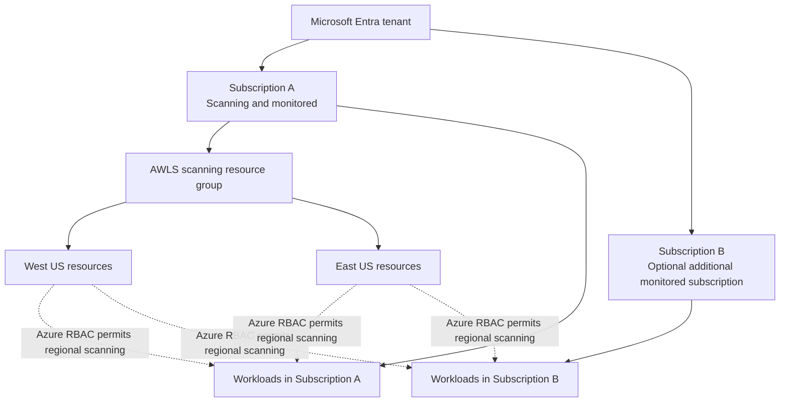
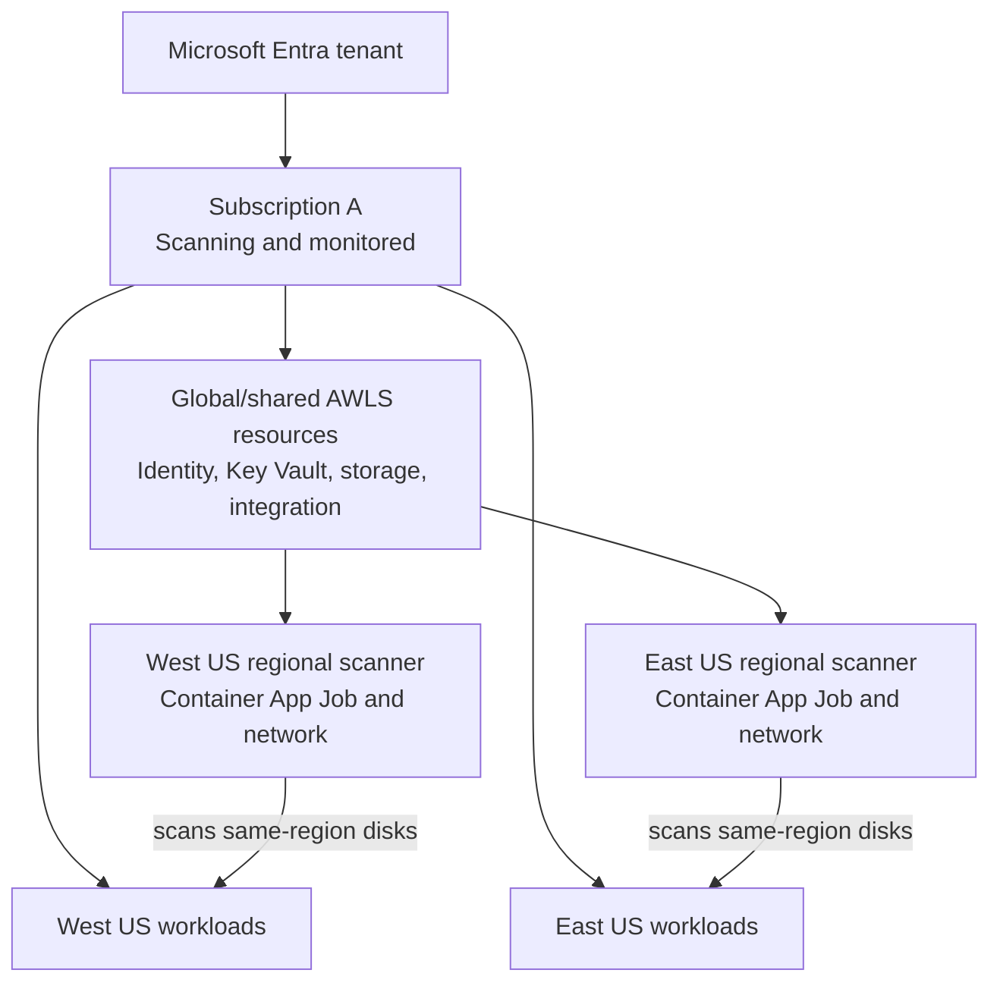
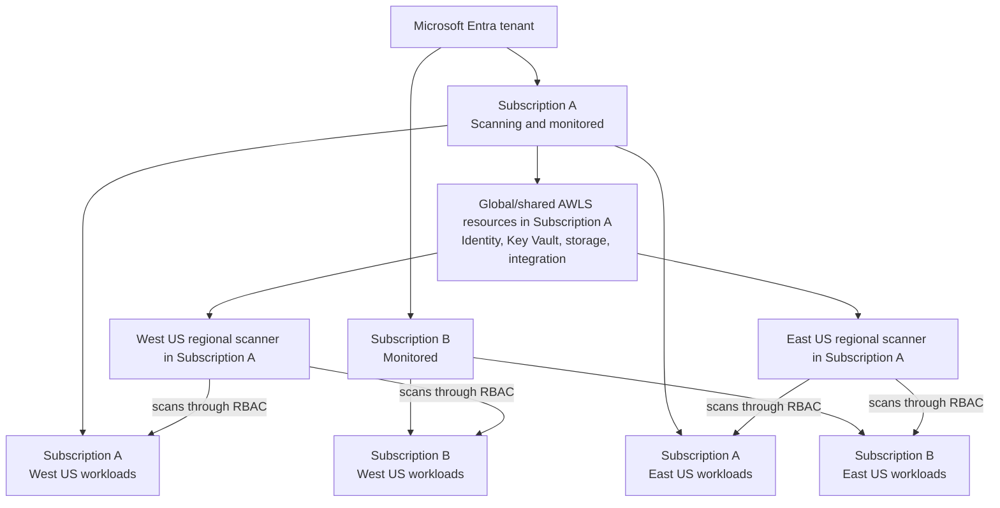

# FortiCNAPP Agentless Workload Scanning for Microsoft Azure

This guide documents subscription-level deployment of FortiCNAPP Agentless Workload Scanning (AWLS) on Microsoft Azure using the FortiCNAPP CLI and the official Terraform module.

AWLS scans supported Azure virtual-machine disks for host vulnerabilities, container-image vulnerabilities, and supported secrets without installing an agent inside the monitored workload. It does not provide runtime activity monitoring or behavioral telemetry; deploy the FortiCNAPP agent when those capabilities are required.

> [!IMPORTANT]
> Replace the masked subscription IDs and region names in all examples. Review every Terraform plan before applying it.

## How Azure AWLS works

1. Terraform creates the global and regional scanning infrastructure in a customer-controlled Azure scanning subscription.
2. A regional Azure Container App Job periodically identifies eligible virtual machines in the configured scope.
3. The service clones the relevant VM disks into the scanning subscription.
4. Temporary scanning VMs mount the cloned disks and inspect their contents without installing software in the source VM.
5. Scan artifacts and metadata are written to the customer-owned Azure Storage Account and made available to FortiCNAPP for evaluation.
6. Temporary scanning resources and stale artifacts are cleaned up automatically.

The Container App Job checks hourly whether work is due. The configured scan frequency controls collection frequency; vulnerability results are evaluated and published by FortiCNAPP on its evaluation schedule.

## Azure resource model

Azure subscriptions are ownership, authorization, policy, quota, and billing boundaries. Azure regions are physical deployment locations. A region is not above a subscription in the Azure hierarchy.

### Azure hierarchy



The subscription is the Azure ownership and authorization boundary. The region describes where an individual Azure resource or workload is physically deployed. AWLS infrastructure can reside in one scanning subscription while Azure RBAC permits it to scan workloads in other subscriptions within the configured scope.

> [!TIP]
> **The simplest way to remember the design:** adding a subscription expands authorization and workload coverage; adding a region creates another regional scanner stack.

### Global resources

Global resources are created once per AWLS integration by the module where `global = true`. In a multi-region deployment, the first generated regional module is the global module.

- FortiCNAPP cloud-account integration
- Microsoft Entra ID application and service principal
- User-assigned managed identity
- Azure Key Vault and secret
- Customer-owned Azure Storage Account and blob container
- Shared custom role definitions and role assignments
- Shared integration metadata used by regional modules

“Global” is a logical Terraform role. These Azure resources still have a physical Azure location, normally the first region listed during generation.

### Regional resources

Regional resources are created in every region containing workloads that must be scanned.

- Azure Container Apps Environment
- Azure Container App Job
- Virtual network and subnet
- Network Security Group
- NAT Gateway and public IP when NAT is enabled
- Optional Log Analytics workspace
- Temporary scanning VMs, cloned disks, snapshots, and network interfaces created during scanning

For multi-region deployments, only the first module uses `global = true`. Additional regional modules use `global = false` and receive `global_module_reference` from the first module.

## Deployment topology comparison

### One subscription, two regions



This design has one monitored subscription, one set of global resources, and one regional scanner deployment in each of the two regions.

### Two subscriptions, two regions



Adding Subscription B does **not** create another complete AWLS stack when both subscriptions use the same scanning subscription and regions. The same West US and East US regional scanners can scan eligible same-region workloads across both monitored subscriptions through Azure RBAC.

### What actually changes when a second subscription is added

Assume Subscription A is both the scanning subscription and a monitored subscription. Subscription B is an additional monitored subscription. West US and East US are already configured as scanning regions.

With only Subscription A, AWLS can scan:

```text
Subscription A / West US
Subscription A / East US
```

After Subscription B is added, the same regional scanners can scan:

```text
Subscription A / West US
Subscription A / East US
Subscription B / West US
Subscription B / East US
```

Terraform primarily adds the following for Subscription B:

- Subscription B is added to `included_subscriptions`.
- The required AWLS authorization is established at Subscription B scope.
- Azure role assignments allow the AWLS identity to discover eligible VMs and process their disks in Subscription B.
- The FortiCNAPP integration's monitored scope includes Subscription B.

Terraform does **not** normally create another Storage Account, Key Vault, managed identity, FortiCNAPP integration, or regional scanner stack merely because Subscription B was added.

| Area | One subscription, two regions | Two subscriptions, two regions |
|---|---|---|
| Global AWLS integration | One | One |
| Scanning subscription | One | One |
| Regional scanner deployments | Two | Two |
| Monitored subscriptions | One | Two |
| `included_subscriptions` entries | One | Two |
| Cross-subscription authorization | Not needed for a separate monitored subscription | Required for Subscription B |
| Workload coverage | Eligible workloads in Subscription A | Eligible workloads in Subscriptions A and B |
| Scanner-infrastructure billing | Scanning subscription | Same scanning subscription |
| Expected scan volume and cost | Based on workloads in one subscription | May increase because both subscriptions contribute workloads |

The number of regional scanner deployments follows the number of configured regions, not the number of monitored subscriptions. Adding a subscription mainly expands authorization and workload scope. Adding a region creates another regional Container Apps and networking stack.

> [!IMPORTANT]
> Adding Subscription B can still increase consumption costs because the existing scanners process more workloads, snapshots, cloned disks, and scan data. It does not double the persistent scanner infrastructure when the configured regions remain unchanged.

```text
More subscriptions = broader RBAC scope and more workloads
More regions       = more regional scanner infrastructure
```

## Prerequisites

- FortiCNAPP administrator access
- FortiCNAPP CLI installed and configured
- Terraform 1.9 or later
- Azure CLI installed and authenticated
- Deployment permissions required by the official Azure AWLS documentation
- Access to create role definitions and role assignments in the scanning and monitored subscriptions
- Adequate regional Azure vCPU and public-IP quotas for scanner workloads
- TCP 443 egress from scanner infrastructure to required Azure and FortiCNAPP endpoints
- All subscriptions in a subscription-level integration should be accessible in the same Microsoft Entra tenant

Verify the active Azure context before deployment:

```powershell
az account show --query "{Subscription:name,SubscriptionId:id,Tenant:tenantId,User:user.name}" -o table
```

List workload regions before choosing scanner regions:

```powershell
az vm list --subscription "<MONITORED_SUBSCRIPTION_ID>" --query "[].{VM:name,Region:location,ResourceGroup:resourceGroup}" -o table
```

Deploy regional scanner infrastructure only in regions containing workloads that need to be scanned.

## CLI deployment examples

The following examples enable only AWLS. Configuration, Activity Log, and Entra ID Activity Log integrations are not enabled.

### One subscription, one region

```powershell
lacework generate cloud-account azure --agentless --integration_level "SUBSCRIPTION" --agentless_subscription_ids "<SCANNING_SUBSCRIPTION_ID>" --subscription_id "<SCANNING_SUBSCRIPTION_ID>" --regions "<PRIMARY_REGION>" --global=true --noninteractive --output "/home/<USER>/azure-agentless-single-sub-single-region"
```

### Two subscriptions, one region

```powershell
lacework generate cloud-account azure --agentless --integration_level "SUBSCRIPTION" --agentless_subscription_ids "<SCANNING_SUBSCRIPTION_ID>,<SECOND_MONITORED_SUBSCRIPTION_ID>" --subscription_id "<SCANNING_SUBSCRIPTION_ID>" --regions "<PRIMARY_REGION>" --global=true --noninteractive --output "/home/<USER>/azure-agentless-two-subs-single-region"
```

### Two subscriptions, two regions

```powershell
lacework generate cloud-account azure --agentless --integration_level "SUBSCRIPTION" --agentless_subscription_ids "<SCANNING_SUBSCRIPTION_ID>,<SECOND_MONITORED_SUBSCRIPTION_ID>" --subscription_id "<SCANNING_SUBSCRIPTION_ID>" --regions "<PRIMARY_REGION>,<SECOND_REGION>" --global=true --noninteractive --output "/home/<USER>/azure-agentless-two-subs-two-regions"
```

In these commands:

- `--agentless_subscription_ids` lists the subscriptions whose workloads will be monitored.
- `--subscription_id` identifies the subscription where AWLS infrastructure is deployed and billed.
- `--regions` lists the regions in which regional scanner infrastructure is created.
- The first region is used by the module containing the shared global resources.
- Subscription IDs and regions are comma-separated, with no curly quotation marks.

## Generate, review, and deploy

Use a separate directory for each independent Terraform deployment. Do not mix a new configuration with a state file belonging to another deployment.

```powershell
Set-Location "/home/<USER>/<GENERATED_OUTPUT_DIRECTORY>"
terraform init
terraform fmt
terraform validate
terraform plan -out awls.tfplan
terraform apply awls.tfplan
```

Do not commit these files to source control:

- `terraform.tfstate`
- `terraform.tfstate.backup`
- saved plan files such as `awls.tfplan`
- FortiCNAPP or Azure credentials

Terraform state can contain sensitive values. Use a protected remote backend for production or team-managed deployments.

## Multi-region Terraform structure

A generated two-region deployment should follow this pattern:

```hcl
module "awls_primary_region" {
  source  = "lacework/agentless-scanning/azure"
  version = "~> 1.6"

  global                   = true
  integration_level        = "SUBSCRIPTION"
  region                   = "<PRIMARY_REGION>"
  scanning_subscription_id = "<SCANNING_SUBSCRIPTION_ID>"

  included_subscriptions = [
    "/subscriptions/<SCANNING_SUBSCRIPTION_ID>",
    "/subscriptions/<SECOND_MONITORED_SUBSCRIPTION_ID>",
  ]
}

module "awls_second_region" {
  source  = "lacework/agentless-scanning/azure"
  version = "~> 1.6"

  global                   = false
  global_module_reference  = module.awls_primary_region
  integration_level        = "SUBSCRIPTION"
  region                   = "<SECOND_REGION>"
  scanning_subscription_id = "<SCANNING_SUBSCRIPTION_ID>"
}
```

Set `included_subscriptions` only on the global module. Regional modules inherit the shared configuration through `global_module_reference`.

## Important module inputs

The official module README is the source of truth for inputs, types, and defaults.

| Input | Description | Type | Default |
|---|---|---:|---:|
| [`create_log_analytics_workspace`](https://github.com/lacework/terraform-azure-agentless-scanning/tree/main#input_create_log_analytics_workspace) | Creates a Log Analytics workspace to see container logs. Defaults to `false` to avoid charging. | `bool` | `false` |
| [`global`](https://github.com/lacework/terraform-azure-agentless-scanning/tree/main#input_global) | Creates shared global resources for this deployment. Only one module in a multi-region integration should set this to `true`. | `bool` | `false` |
| [`global_module_reference`](https://github.com/lacework/terraform-azure-agentless-scanning/tree/main#input_global_module_reference) | Passes shared outputs from the global module to an additional regional module. | `object` | Empty object |
| [`included_subscriptions`](https://github.com/lacework/terraform-azure-agentless-scanning/tree/main#input_included_subscriptions) | Subscription resource IDs monitored by a `SUBSCRIPTION`-level integration. Set only on the global module. | `set(string)` | `[]` |
| [`integration_level`](https://github.com/lacework/terraform-azure-agentless-scanning/tree/main#input_integration_level) | Integration scope: `SUBSCRIPTION` or `TENANT`. | `string` | Required |
| [`region`](https://github.com/lacework/terraform-azure-agentless-scanning/tree/main#input_region) | Azure region where the regional scanner is deployed. | `string` | `westus2` |
| [`scan_containers`](https://github.com/lacework/terraform-azure-agentless-scanning/tree/main#input_scan_containers) | Enables scanning of supported container images found on workload disks. | `bool` | `true` |
| [`scan_frequency_hours`](https://github.com/lacework/terraform-azure-agentless-scanning/tree/main#input_scan_frequency_hours) | Number of hours between scheduled scans. | `number` | `24` |
| [`scan_host_vulnerabilities`](https://github.com/lacework/terraform-azure-agentless-scanning/tree/main#input_scan_host_vulnerabilities) | Enables host vulnerability scanning. | `bool` | `true` |
| [`scan_multi_volume`](https://github.com/lacework/terraform-azure-agentless-scanning/tree/main#input_scan_multi_volume) | Enables scanning of supported secondary volumes in addition to the root volume. | `bool` | `false` |
| [`scan_stopped_instances`](https://github.com/lacework/terraform-azure-agentless-scanning/tree/main#input_scan_stopped_instances) | Enables scanning of stopped instances. | `bool` | `true` |
| [`scanning_subscription_id`](https://github.com/lacework/terraform-azure-agentless-scanning/tree/main#input_scanning_subscription_id) | Subscription in which AWLS scanner infrastructure is deployed. | `string` | Current AzureRM subscription when blank |
| [`use_nat_gateway`](https://github.com/lacework/terraform-azure-agentless-scanning/tree/main#input_use_nat_gateway) | Uses a NAT Gateway rather than assigning public IP addresses to individual scanning instances. | `bool` | `true` |

> [!NOTE]
> `create_log_analytics_workspace = false` does not disable AWLS. It only prevents the module from creating the optional Log Analytics workspace used to view Container App logs.


## Validate the deployment

Confirm Terraform has no pending differences:

```powershell
terraform plan
```

Expected result after a successful apply:

```text
No changes. Your infrastructure matches the configuration.
```

Confirm the FortiCNAPP integration:

```powershell
lacework cloud-account list
```

List regional Container App Jobs:

```powershell
az containerapp job list --subscription "<SCANNING_SUBSCRIPTION_ID>" --query "[].{Name:name,ResourceGroup:resourceGroup,Location:location,State:properties.provisioningState}" -o table
```

Inspect job executions:

```powershell
az containerapp job execution list --name "<JOB_NAME>" --resource-group "<SCANNING_RESOURCE_GROUP_NAME>" -o table
```

Start a job manually for troubleshooting when appropriate:

```powershell
az containerapp job start --name "<JOB_NAME>" --resource-group "<SCANNING_RESOURCE_GROUP_NAME>"
```

In FortiCNAPP, view agentless vulnerability results under **Vulnerabilities > Hosts** or **Vulnerabilities > Containers**. For container results, group by image ID and filter **Scanner type** to **Agentless**.

## Deprovisioning safely

Always destroy from the directory containing the state that created the deployment:

```powershell
Set-Location "/home/<USER>/<GENERATED_OUTPUT_DIRECTORY>"
terraform state list
terraform plan -destroy
terraform destroy
```

Running `terraform destroy` from a newly generated directory with an empty state will report:

```text
No changes. No objects need to be destroyed.
```

That message does not prove that Azure contains no AWLS resources; it only means the current Terraform state manages none.

# Azure Agentless Workload Scanner Preflight Check

The [Azure Agentless Workload Scanner Preflight Check](https://github.com/lacework/terraform-azure-agentless-scanning/tree/main/preflight_check) validates whether an Azure environment is ready for Lacework/FortiCNAPP Agentless Workload Scanning (AWLS).

The tool:

- Counts the virtual machines in the intended monitoring scope.
- Validates the required AWLS deployment permissions.
- Validates regional vCPU quotas based on the number of VMs to scan.
- Validates public-IP quotas when AWLS is deployed without a NAT Gateway.
- Writes detailed test results to a JSON report.

> [!IMPORTANT]
> Do not download only [`core/preflight_check.py`](https://github.com/lacework/terraform-azure-agentless-scanning/blob/main/preflight_check/preflight_check/core/preflight_check.py). It is an internal package file that depends on the other Python modules, `pyproject.toml`, and `uv.lock` in the complete `preflight_check` directory.

## Before you begin

Prepare the following values. Replace only the masked values and region codes in the examples:

| Value | Meaning | Example format |
|---|---|---|
| `<SCANNING_SUBSCRIPTION_ID>` | Subscription where the AWLS scanner resources will be deployed and billed | Azure subscription UUID |
| `<SECOND_MONITORED_SUBSCRIPTION_ID>` | Additional subscription whose workloads will be scanned | Azure subscription UUID |
| `<PRIMARY_REGION_CODE>` | First/global AWLS deployment region | `westus` |
| `<SECOND_REGION_CODE>` | Additional AWLS deployment region | `eastus` |

Azure region **codes** are used by this test (`westus,eastus`), while the Lacework generator may display region names (`West US,East US`). Do not put a space after the comma.

## Step 1 — Open Azure Cloud Shell

Open Azure Cloud Shell and select **PowerShell**. Cloud Shell uses Linux underneath, so the Linux `uv` installer is correct even though the prompt starts with `PS`.

## Step 2 — Check available home-directory space

```powershell
df -h /home/$env:USER
```

Make sure the `/home` filesystem is not at or near 100%. If adequate space is available, continue to Step 3.

If it is full, first confirm that Terraform is not running:

```powershell
Get-Process terraform -ErrorAction SilentlyContinue
```

If this returns no process, list the recreatable `.terraform` dependency directories:

```powershell
bash -lc 'find /home/$USER -xdev -type d -name .terraform -prune -print'
```

After reviewing that list, remove only those dependency directories and check the free space again:

```powershell
bash -lc 'find /home/$USER -xdev -type d -name .terraform -prune -exec rm -rf -- {} +'
df -h /home/$env:USER
```

This does not delete `main.tf`, Terraform state, or Azure resources. Run `terraform init` in a Terraform project before using that project again.

## Step 3 — Download the complete test tool

Clone the official repository and enter its preflight directory:

```powershell
git clone --depth 1 https://github.com/lacework/terraform-azure-agentless-scanning.git
Set-Location ./terraform-azure-agentless-scanning/preflight_check
```

If the repository is already cloned, update it:

```powershell
Set-Location ./terraform-azure-agentless-scanning
git pull --ff-only
Set-Location ./preflight_check
```

Do not clone the repository while already inside its `preflight_check` directory, because that creates an unnecessary nested copy.

## Step 4 — Authenticate to Azure

Select the subscription where AWLS scanner infrastructure will be deployed:

```powershell
az login
az account set --subscription "<SCANNING_SUBSCRIPTION_ID>"
az account show --query "{Subscription:id,Tenant:tenantId,User:user.name}" -o table
```

Confirm that the displayed subscription and tenant are correct. The signed-in identity must be able to read the scanning subscription and every monitored subscription.

## Step 5 — Install and verify `uv`

Azure Cloud Shell runs on Linux even when its command interface is PowerShell. Install the [`uv` package manager](https://docs.astral.sh/uv/) with the official Linux installer:

```powershell
bash -c 'curl -LsSf https://astral.sh/uv/install.sh | sh'
```

Add the default installation directory to the current PowerShell session and verify the installation:

```powershell
$env:PATH = "$HOME/.local/bin:$env:PATH"
uv --version
```

If the current session still cannot find `uv`, invoke it by its absolute path:

```powershell
& "$HOME/.local/bin/uv" --version
```

## Step 6 — Enter the preflight directory

For the repository path used in this deployment:

```powershell
Set-Location "/home/hussam/alws-subs-multi-region/terraform-azure-agentless-scanning/preflight_check"
Get-ChildItem
```

Confirm that the directory contains `preflight_check`, `pyproject.toml`, and `uv.lock`.

## Step 7 — Display the available options

```powershell
uv run -m preflight_check --help
```

## Step 8A — Run the test interactively

```powershell
uv run -m preflight_check
```

If `uv` is not on `PATH`, run:

```powershell
& "$HOME/.local/bin/uv" run -m preflight_check
```

The tool prompts for:

- Scanning subscription
- Monitored or excluded subscriptions
- Scanning regions
- NAT Gateway preference
- Report output location

Enter region codes such as `westus` and `eastus`. Choose the same NAT Gateway setting that will be used by the AWLS Terraform deployment.

## Step 8B — Run the test non-interactively

Example for two monitored subscriptions and two regions with a NAT Gateway:

```powershell
uv run -m preflight_check --scanning-subscription "<SCANNING_SUBSCRIPTION_ID>" --monitored-subscriptions "<SCANNING_SUBSCRIPTION_ID>,<SECOND_MONITORED_SUBSCRIPTION_ID>" --regions "<PRIMARY_REGION_CODE>,<SECOND_REGION_CODE>" --nat-gateway --output-path "./preflight_report.json"
```

Use Azure region codes such as `westus,eastus`:

```powershell
uv run -m preflight_check --scanning-subscription "<SCANNING_SUBSCRIPTION_ID>" --monitored-subscriptions "<SCANNING_SUBSCRIPTION_ID>,<SECOND_MONITORED_SUBSCRIPTION_ID>" --regions "westus,eastus" --nat-gateway --output-path "./preflight_report.json"
```

Examples for common deployment scopes follow.

### One subscription, one region

```powershell
uv run -m preflight_check --scanning-subscription "<SCANNING_SUBSCRIPTION_ID>" --monitored-subscriptions "<SCANNING_SUBSCRIPTION_ID>" --regions "westus" --nat-gateway --output-path "./preflight_report.json"
```

### Two subscriptions, one region

```powershell
uv run -m preflight_check --scanning-subscription "<SCANNING_SUBSCRIPTION_ID>" --monitored-subscriptions "<SCANNING_SUBSCRIPTION_ID>,<SECOND_MONITORED_SUBSCRIPTION_ID>" --regions "westus" --nat-gateway --output-path "./preflight_report.json"
```

### Two subscriptions, two regions

```powershell
uv run -m preflight_check --scanning-subscription "<SCANNING_SUBSCRIPTION_ID>" --monitored-subscriptions "<SCANNING_SUBSCRIPTION_ID>,<SECOND_MONITORED_SUBSCRIPTION_ID>" --regions "westus,eastus" --nat-gateway --output-path "./preflight_report.json"
```

## Step 9 — Match the network test to the deployment

- Use `--nat-gateway` when Terraform uses `use_nat_gateway = true`.
- Use `--no-nat-gateway` when Terraform uses `use_nat_gateway = false`.
- Without a NAT Gateway, the tool also validates the public-IP quota required by scanning instances.

Only use one of these two flags. Do not specify both in the same command.

## Step 10 — Review the results

Review both the console summary and the generated report:

```powershell
Get-Content ./preflight_report.json
```

Resolve any failed permission, regional vCPU quota, or public-IP quota checks before running `terraform apply`.

A successful summary should indicate that quota limits are sufficient and permission checks passed. The JSON file contains the detailed evidence.

## Step 11 — Continue with AWLS deployment

The preflight tool validates readiness; it does not deploy AWLS. After all checks pass, return to the directory containing the generated AWLS `main.tf` and run:

```powershell
terraform init
terraform plan
terraform apply
```

Review the plan before approving the apply.

## Troubleshooting

### `uv` is not recognized

```powershell
$env:PATH = "$HOME/.local/bin:$env:PATH"
& "$HOME/.local/bin/uv" --version
```

### `No space left on device`

Follow Step 2 to remove recreatable `.terraform` dependency caches. Do not delete Terraform state files.

### Azure access token or login error

```powershell
az login
az account set --subscription "<SCANNING_SUBSCRIPTION_ID>"
az account show -o table
```

Then rerun the preflight command.

### Wrong or nested directory

Return to the original preflight directory:

```powershell
Set-Location "/home/hussam/alws-subs-multi-region/terraform-azure-agentless-scanning/preflight_check"
```

### Permission check fails for the second subscription

Verify that the currently authenticated Azure identity has the required read and deployment permissions at the relevant scope. Including a subscription ID in the command does not grant access to it.

## Reference

| Reference | Purpose |
|---|---|
| [Azure Agentless Workload Scanner Preflight Check](https://github.com/lacework/terraform-azure-agentless-scanning/tree/main/preflight_check) | Validation tool to ensure the Azure environment is properly configured before deploying the Lacework Agentless Scanner |


## Reference documentation

| Reference | Purpose |
|---|---|
| [Official Azure AWLS Terraform module](https://github.com/lacework/terraform-azure-agentless-scanning/tree/main) | Authoritative module inputs, outputs, resources, requirements, preflight checks, and deprovisioning guidance |
| [Azure Agentless Workload Scanner Preflight Check](https://github.com/lacework/terraform-azure-agentless-scanning/tree/main/preflight_check) | Validation tool to ensure the Azure environment is properly configured before deploying the Lacework Agentless Scanner |
| [Azure AWLS module examples](https://github.com/lacework/terraform-azure-agentless-scanning/tree/main/examples) | Single-region, multi-region, tenant-level, subscription-level, and custom-network examples |
| [Terraform Registry: Azure agentless scanning](https://registry.terraform.io/modules/lacework/agentless-scanning/azure/latest) | Published module version and generated documentation |
| [Subscription-level single-region example](https://github.com/lacework/terraform-azure-agentless-scanning/tree/main/examples/subscription-single-region) | Global and regional resources in one region |
| [Subscription-level multi-region example](https://github.com/lacework/terraform-azure-agentless-scanning/tree/main/examples/subscription-multi-region) | One global module with additional regional modules |
| [Custom VNet example](https://github.com/lacework/terraform-azure-agentless-scanning/tree/main/examples/custom-vnet) | Deploying AWLS with existing/custom networking |
| [FortiCNAPP: Integrating your Azure environment](https://docs.fortinet.com/document/forticnapp/latest/administration-guide/729300/integrating-your-azure-environment) | Azure scanning workflow and global/regional deployment model |
| [FortiCNAPP: Preparing for Azure integration](https://docs.fortinet.com/document/forticnapp/latest/administration-guide/991151/preparing-for-integration) | Permissions, quotas, limitations, and preflight guidance |
| [FortiCNAPP: Deploying AWLS on Azure](https://docs.fortinet.com/document/forticnapp/latest/administration-guide/42109/deploying-agentless-workload-scanning-on-azure) | Deployment procedure and validation |
| [FortiCNAPP: Viewing agentless results](https://docs.fortinet.com/document/forticnapp/latest/administration-guide/692150) | Host and container result locations and filters |
| [FortiCNAPP: Agentless scanning FAQ](https://docs.fortinet.com/document/forticnapp/latest/administration-guide/269317/agentless-workload-scanning-faqs) | Scan behavior, timing, container support, storage, and cleanup |

## Security and cost notes

- Use a dedicated scanning subscription for larger or production deployments when practical.
- Grant only the documented permissions required by AWLS.
- Keep Terraform state and FortiCNAPP credentials out of source control.
- Review regional vCPU, public-IP, NAT Gateway, Storage Account, Container Apps, temporary VM, disk, snapshot, and optional Log Analytics costs.
- `create_log_analytics_workspace = false` avoids the cost of a module-created workspace but reduces access to Container App logs.
- Reduce scan frequency only after considering the additional Azure snapshot and scanning costs.
- Deploy scanner infrastructure only in required workload regions.
