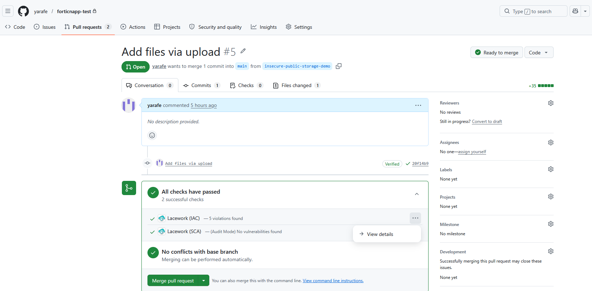
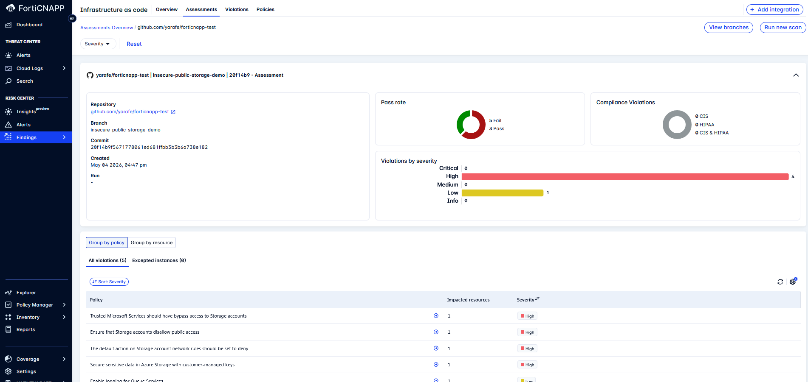
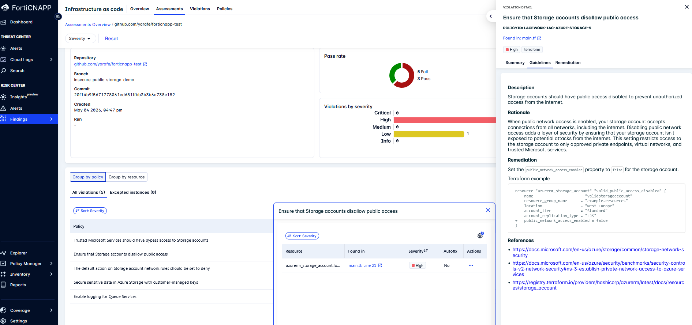
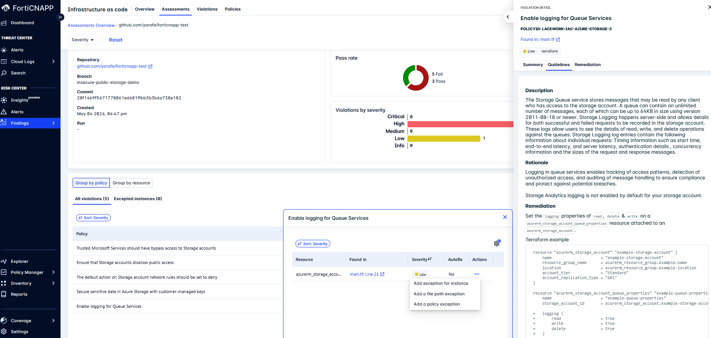
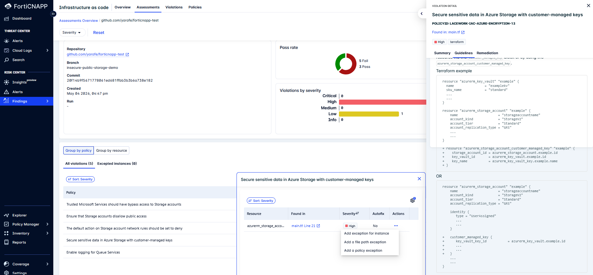
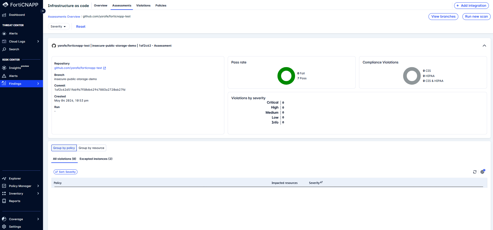
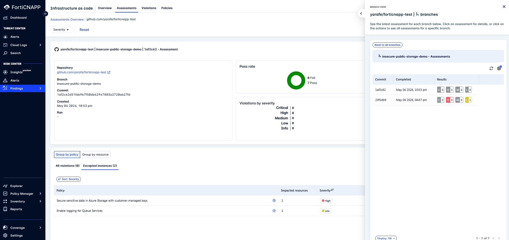

# FortiCNAPP SCM GitHub Integration  
## Overview

This proof of value demonstrates how FortiCNAPP Code Security integrates directly with GitHub Source Control Management (SCM) to automatically scan Terraform code during Pull Requests—without requiring GitHub Actions, CI/CD pipelines, or custom automation.

The objective is to validate a simple and effective shift-left DevSecOps workflow where infrastructure-as-code (IaC) security issues are identified and surfaced before deployment.

This use case demonstrates how FortiCNAPP Code Security can:

- Detect Terraform misconfigurations during Pull Request creation
- Scan code automatically using native GitHub SCM integration
- Surface findings directly in GitHub and FortiCNAPP
- Enable remediation before merge or deployment
- Eliminate the need for CI/CD-based security scanning

This approach provides a streamlined security control point early in the development lifecycle, reducing operational complexity while improving IaC governance.

---

## Business Value

Modern DevOps teams often rely on CI/CD pipelines to perform infrastructure security scanning. While effective, this approach introduces additional operational overhead:

- Pipeline maintenance
- Workflow configuration
- Secret management
- Build execution costs
- Delayed feedback loops

FortiCNAPP’s SCM-native scanning model removes these dependencies by integrating directly with GitHub and evaluating Terraform changes as part of the Pull Request lifecycle.

### Key Outcomes

- Shift security left by identifying IaC risks before deployment
- Reduce CI/CD complexity by removing pipeline dependencies for code scanning
- Accelerate developer feedback with security results directly in Pull Requests
- Improve governance with centralized policy evaluation in FortiCNAPP
- Prevent misconfigurations from reaching production environments

---

## Use Case Scenario

A developer submits a Terraform Pull Request containing an insecure Azure Storage Account configuration.

The proposed change includes:

- Public object exposure enabled

FortiCNAPP automatically scans the Pull Request, detects both policy violations, and reports findings before the code is merged.

This validates that Terraform misconfigurations can be identified and remediated at the Pull Request stage—before deployment to Azure.

---

## Architecture

This use case uses FortiCNAPP SCM Integration based on the GitHub App integration model.

Unlike traditional CI/CD scanning, this architecture does not require:

- GitHub Actions
- External CI pipelines
- Manual scan execution
- Pipeline secrets or tokens
- Custom webhook automation

Instead, FortiCNAPP connects directly to GitHub and responds to repository events natively.

### Event-Driven Workflow

FortiCNAPP automatically initiates scanning when:

- A Pull Request is opened
- A new commit is pushed to an existing Pull Request
- A repository is onboarded into Code Security

This creates a lightweight, scalable, and developer-friendly security workflow without pipeline dependency.

---

## How It Works

With GitHub SCM integration enabled, FortiCNAPP performs the following workflow automatically:

1. Detects Pull Request creation in GitHub
2. Clones the repository securely
3. Reads the Code Security configuration from `.lacework/codesec.yaml`(optional)
4. Scans Terraform files in the Pull Request
5. Evaluates findings against FortiCNAPP policies
6. Posts scan status and findings back to GitHub
7. Uploads detailed results to FortiCNAPP Code Security

This creates a Pull Request-native security workflow where developers receive immediate security feedback within their normal GitHub process.

---

## Prerequisites

Before validating this use case, ensure the following components are already configured:

- GitHub account
- FortiCNAPP tenant
- GitHub repository containing Terraform code
- FortiCNAPP Code Security enabled
- GitHub SCM integration configured in FortiCNAPP. Please, review the [documentation](https://docs.fortinet.com/document/forticnapp/latest/administration-guide/78613/github) for more details.
- Repository onboarded into FortiCNAPP Code Security

---

## Repository Structure

```text
github-terraform-iac-pov/
├── .lacework/
│   └── codesec.yaml (optional)
├── terraform/
│   └── main.tf
└── README.md
```

## Step-by-Step Walkthrough

- Create a branch insecure-storage-demo
- Add intentionally insecure terraform "main.tf" file to the branch and open PR
  
  
  
- Once the Pull Request is created, FortiCNAPP should:
  - detect the PR event
  - scan the Terraform files
  - identify IaC issues
  - post status back to GitHub
  - upload findings to FortiCNAPP
- If you click on view details from github, it will forward you to forticnapp IAC assesment.
  
  
  
- Click on the any violation (ex: Ensure that Storage accounts disallow public access) it will show you summary, guidline and remidiation to fix the issue.
  I will follow the guidline to fix public storage issues and add networkrule to fix 3 high sercerity violations.
  
  

- You can take action also to add an excption based on instance, file path or policy. I will add exception for the following violations shown in the screenshots below:
  
  
  
  
  
- Once i make commit on branch, it will triger again iac scan on github.
- After a scan Forticnapp shows no violations and two exceptions were added.
  
  

  
  
- You can see assesments history : from assesmrnts = > view branches = > view assesment list for this branch 
